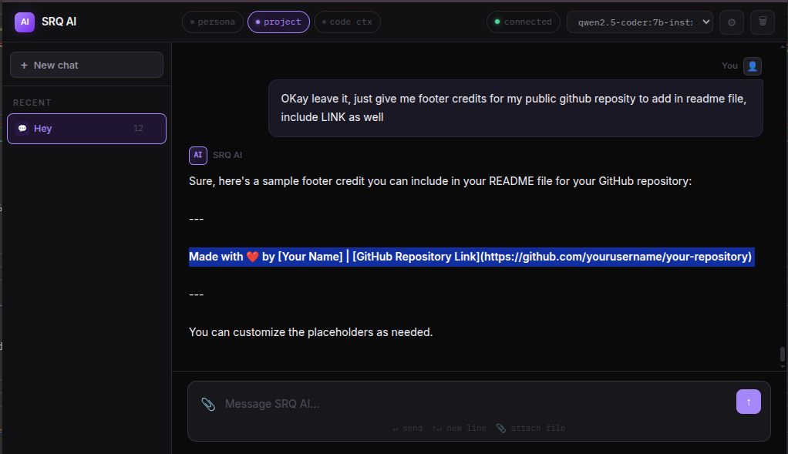

It only works on Linux currently, cause ./run.sh

# LGPT
Run your own chat interface lightweight with just html and simple webserver with bash connected to your Ollama models.

Just `./run.sh` to start

## Features
- Chat
- Sessions
- File uploads
- File chunking to analyze big file into smaller contexts
- Close other models when switch to new model from dropdown to save memory
- Memory optimized 
- Local DB folder to store all sessions, chats history

----------------
Made with ❤️ by Muhammed Shariqq Ahmed
- My Website : [Best Developer in Hyderabad](https://cksoftwares.com)
- HIRE Me on Whatsapp | [Open Whatsapp](https://wa.me/917997807419)
- Email | mshariq@cksoftwares.com
- ~ Hyderabad, India